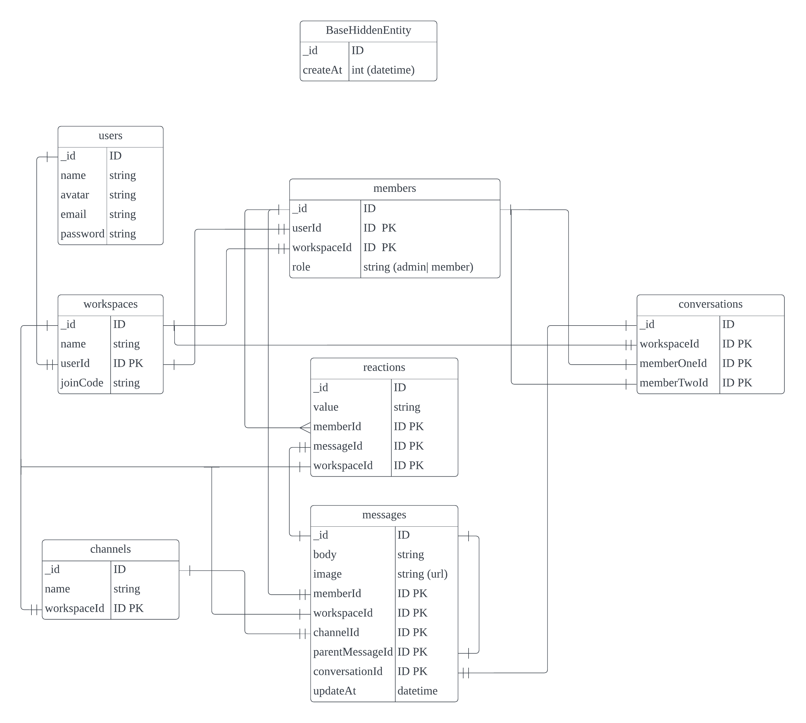

## Intro

"A Slack-like app made with Next.js that supports real-time chat for multiple users. It uses a simple backend design and clean code structure."

## Features

- NextJS framework with TailwindCSS and TypeScript (bun for package management)
- Use Shadcn/ui component to make consistent Web UI apperance
- Full-Stack, Using Real-time database and convex backend api
- Support normal password auth and Github, Google OAuth
- Use Quill Editor for markdown editing and renderering
- Auth, Workspace, Membership, Channel ,Conversation CURD
- Search channels or members
- Support one-on-one chats or group chats in channels. send images, react to messages with emojis, and reply to messages in thread.
- Eslint supported with 0 syntax error
- Deployed to vercel for prodution live demo

---

### [LIVE DEMO](https://slack-clone-ebon-phi.vercel.app/)

## Screenshots


## Entity relation diagram



## Start the project

First, run the development server:

```bash
# start next convex realtime db and server backend
bunx convex dev
# start next web app
bun run dev
```

## TODOs

1. Add unit tests and end-to-end test code to increase test coverage
2. Support dark mode
3. Responsive UI for mobile and iPad
4. Complete other features gradually
5. ...

## AUTH

[google](https://console.cloud.google.com/welcome?project=slack-clone-production-439913)
[github](https://github.com/settings/developers)
